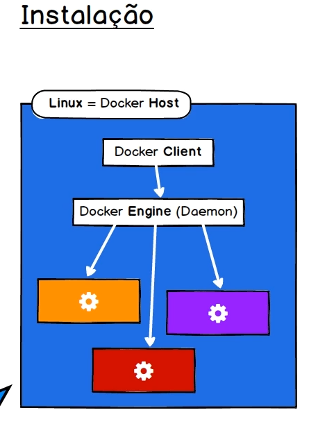

# Docker

Sistema de Virtualização não tradicional. É uma engine de administração de containers.

Containers são processos isolados associados a sistemas de arquivos isolado. 

A execução não é totalmente isolada do host. Existe compartilhamento de recursos, como memória e Kernel, por exemplo.

Utiliza tecnologia LXC (Linux Containers). Ou seja, não podemos usar um host MacOS, por exemplo. Mas essa limitação não tem muito impacto porque a maior parte dos sistemas usam o Kernel Linux.

Usamos containers ao invés de Máquinas Virtuais pois:

Conseguimos iniciar um container mais rapidamente (pois o Kernel é compartilhado)

Usamos menos recursos

Definimos quantos recursos iremos usar

## Containers 

Isolação de processos no mesmo Kernel

Sistema de arquivos criados a partir de uma imagem

Ambientes leves e portáteis no qul aplicações são executadas

Encapsula todos os binários e bibliotecas necessárias para execução de um App

Algo entre chroot e uma Virtual Machine

A boa prática é separar a aplicação entre vários containers.

## Imagens Docker

Modelo de sistema de arquivo read-only para criar containers.

Imagens são criadas a partir do processo Build. Esse build é um processo descritor, que descreve passo a passo as instruções para criar uma imagem.

São armazenadas em repositórios Registry (DockerHub, por exemplo). 

São compostas por uma ou mais camadas (layers). Uma camada representa uma ou mais mudanças no sistema de arquivos. Uma camada é também chamada de imagem intermediária.

A junção de camadas forma a imagem.

Apenas a última camada pode ser alterada quando o container for iniciado.

AUFS (Advanced multi-layered unification filesystem) é muito usado.

O grande objetivo de se ter várias camadas é o reuso.

É possível comport imagens a partir de camadas de outras imagens.

## Imagens X Containers

A Imagem é um modelo que é usado para criar containers. De forma alegórica, a Imagem é como uma classe, e o container uma instância polimórfica.

## Arquitetura


Docker Daemon (Docker server / Docker Engine)

A comunicação com o Docker normalmente é feita pelo terminal, mas também pode ser feita por meio de RestAPI. É feita uma requisição ao DAEMON.

O Daemon local requisita as Imagens guardadas no Registry, com elas, o Daemon monta o container e os coloca para funcionar.

## Instalação



Quando você instala o Docker no Linux, o próprio Linux vira o Docker Host.

Passo 1: Atualize o sistema
```bash
    sudo apt-get update
    sudo apt-get upgrade
```


Passo 2: Instale pacotes necessários
```bash
    sudo apt-get install apt-transport-https ca-certificates curl software-properties-common
```


Passo 3: Adicione a chave GPG oficial do Docker
```bash
    curl -fsSL https://download.docker.com/linux/ubuntu/gpg | sudo gpg --dearmor -o /usr/share/keyrings/docker-archive-keyring.gpg
```

Passo 4: Adicione o repositório do Docker ao APT
```bash
    echo "deb [arch=$(dpkg --print-architecture) signed-by=/usr/share/keyrings/docker-archive-keyring.gpg] https://download.docker.com/linux/ubuntu $(lsb_release -cs) stable" | sudo tee /etc/apt/sources.list.d/docker.list > /dev/null
```


Passo 5: Atualize o índice de pacotes
```bash
    sudo apt-get update
```


Passo 6: Instale o Docker
```bash
    sudo apt-get install docker-ce docker-ce-cli containerd.io
```


Passo 7: Verifique se o Docker foi instalado corretamente
```bash
    sudo docker --version
```


Passo 8: Adicione seu usuário ao grupo docker (opcional, mas recomendado)
```bash
    sudo usermod -aG docker $USER
```


Passo 9: Reinicie o sistema ou faça logout/login para aplicar as alterações
```bash
    newgrp docker
```

## Comandos básicos

Run: baixamos uma imagem do registry, CRIAMOS um novo container, executamos um container na forma iterativa.

```bash
    docker container run -it nome_imagem
```

Name: Cria um nome para um container, impedindo que um novo container com o mesmo nome seja criado

```bash
    docker container run --name nome_container
```

ls: Mostra todos os containers criados

```bash
    docker container ls # Mostra os containers ativos

    docker container ls -a # Mostra todos os containers, independentemente de estado
```

start: Inicia um container já criado

```bash
    docker container start nome_container

    docker container start -ai nome_container # Inicia o container e prende ele ao terminal 
```

remover imagem:

```bash
    docker nome_magem rm 
```

## Mapeamento 

### Containers 

```bash
docker container run -p portaExterna:portaInterna nomeImagem

# Exemplo 
# docker container run -p 8080:80 nginx
```

### Pastas

```bash
    docker container run -p portaExterna:portaInterna -v caminho nomeImagem

    #Exemplo
    # docker container run -p 8080:80 -v ${pwd} nginx
```

## Executar container em background

Para isso, usamos o modo Daemon.

Esse modod executa o container em segundo plano.

O seguinte comando é para mapear um caminho para diretório

```bash
    docker container run -d --name nome_container -p portaExterna:portaInterna -v caminho nomeImagem

    # Exemplo
    # docker container run -d --name bla -p 8080:80 -v ${pwd} nginx
```

para parar, use docker container stop nome_container 

### logs

```bash
    docker container logs nome_container 
```

## Construindo imagens

```bash
docker image pull # baixa uma imagem

docker imagem ls # mostra as imagens baixadas

docker image rm # remove uma imagem

docker image inspect # informações sobre uma imagem

docker image tag nome_tag # dá um apelido a uma imagem

docker image build # constrói uma imagem

docker image push # publica uma imagem em algum repositório
```

### Criação

Para criar uma imagem, crie um arquivo Dockerfile

Descreva os passos que você deseja executar nesse arquivo

Crie uma imagem a partir do arquivo Dockerfile

```bash
docker image build -t nomeImagem caminhoParaImagem
```

Crie um conteiner a partir da imagem

```bash
    docker conteiner run -p 8080:80 exemploDeConteiner
```

LEMBRE-SE, a cada comando no dockerfile, uma layer é criada. Se muitos comandos que executam comandos diferentes forem usados no início, a composição vai demorar mais tempo.

### Enviando imagens para o DockerHub

Tendo em posse sua conta no DockerHub, você vai fazer o seguinte:

1 - Nomear sua imagem usando uma tag, no formato seuNome/imagem

2- logar no seu docker

3- Fazer o push da imagem ao DockerHub

```bash
    docker image tag nomeAtualImagem nomeUsuario/nomeAtualImagem

    docker login --username=nomeUsuario

    docker image push nomeUsuario/nomeAtualImagem
```